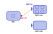

## Composition Package

Dana is designed to allow full programmer control of how a system is composed of its constituent component parts. Individual components can be loaded at runtime, their dependencies inspected, and those dependencies wired to other loaded components as desired. Components can later be hot-swapped for alternataive implementations by re-wiring their dependencies.

When you run a Dana program using a command like `dana MyProgram`, the Dana runtime automatically loads and wires all of the necessary components to construct your system. The composition package contains a set of utilities with which you can construct your own system composer which loads and connects (and later adapts) a given system. When working with a composer you'll then run programs using a command more like `dana MyComposer MyProgram`, where the Dana runtime takes care of loading and running your composer program, and your composer program takes responsibility for loading and running the target application.

If you're looking for an existing and fairly full-featured composer program to get started, take a look at the `pal` package. If you're thinking about writing your own composer program keep reading.

## Loading and Inspecting Components

The loading of individual components is done using two APIs in the base/root package of the Dana standard library: `Loader` and `NativeLoader`. The `Loader` API is used to load compiled Dana components, in `.o` files, while the `NativeLoader` API is used to load native libraries (from a `resources-ext` folder, in `.dnl` files). Both APIs have a `load()` function which returns an `IDC` instance.

The `IDC` interface has a set of functions on it which are used to inspect a loaded component, to wire dependencies of a component to other components, and to assist with runtime hot-swapping of code. As an example of this, the `IDC.getProvides()` function queries the list of provided interfaces on a loaded component, yielding the name and type structure of those interfaces. The examples on this page make extensive use of `IDC` instances, so it's a good idea to familiarise yourself with that interface before continuing.

## The Recursive Loader

The `RecursiveLoader` API provides a convenient method of loading a component and all of its dependencies using a single function call, using the same package- and naming-based dependency resolution rules as the Dana runtime.

Most full composer programs will not use the `RecursiveLoader` because they will include their own equivalent functionality; it is often used to do very simple composition or sub-composition tasks, and can selectively allow a degree of programmer-managed dependency resolution.

As an example we'll write a program which loads the command-line zip application included in Dana's standard library (`app.zip`).

```
component provides App requires composition.RecursiveLoader rloader, System system {

	int App:main(AppParam params[])
		{
		char path[] = "$(system.getDanaHome())/components/app/zip.o"
		LoadedComponents comps = rloader.load(path)

		App subMain = new App() from comps.mainComponent
		subMain.main(new AppParam[](new AppParam("-c"), new AppParam("test.zip"), new AppParam("test.txt")))

		return 0
		}
}
```

Save the above code in a file called `MyApp.dn`, and also create a text file in the same directory called `test.txt`. Then compile and run your program with:

```
dnc MyApp.dn
```

```
dana MyApp.o
```

You'll see a new zip file created which contains your `test.txt` file. In this program we used the recursive loader to load a particular component (which happened to be an `App`, but could have been anything); the recursive loader resolved all dependencies of this component to their default components. We then used the `IDC` of the resulting main component to dynamically instantiate an `App` object against the loaded main component, and call its `main()` function with some invented command-line parameters.

The `RecursiveLoader.load()` function takes a second optional parameter which is a `String` array of required interfaces that the programmer *does not* want the recursive loader to resolve (i.e., the programmer is intending to resolve these dependencies in a different way). This allows a limited degree of control over dependency loading, in cases where the programmer wants most of the work to be done automatically but one or two dependencies will have custom resolution.

## Component Search

A common requirement for composer programs is to locate all components which implement a given interface. The `composition.Search` API provides this capability in a variety of different ways. The `Search.getComponents()` function, for example, uses the standard set of system search paths to locate all component paths which implement the given named interface. The file names of these components is not relevant to the search, but the package locations are relevant and must match the package path indicated in the named interface.

Note that for wiring operations, when two components are being wired together, the Dana runtime itself does not care about package paths or interface names, and only considers the type structures of the two interfaces; the use of package naming by composition.Search matches that of the Dana runtime's own automated linking process, but other naming and search schemes may be constructed by the programmer.

An example of component search is shown below, where we discover all implementations of the `data.query.Sort` interface:

```
component provides App requires composition.Search search, io.Output out {

	int App:main(AppParam params[])
		{
		String options[] = search.getComponents("data.query.Sort")

		for (int i = 0; i < options.arrayLength; i++)
			{
			out.println("option: $(options[i].string)")
			}

		return 0
		}
}
```

Save the above code in a file called `MyApp.dn`, then compile and run your program with:

```
dnc MyApp.dn
```

```
dana MyApp.o
```

This program will print the paths of all components which claim to implement the given named `Sort` interface.

## Wiring

Once components have been loaded via a load operation to gain `IDC` instances, the basic operation to wire two components together is:

```
IDC a = loader.load("CompA.o")
IDC b = loader.load("CompB.o")
a.wire("my.required.Interface", b, "my.provided.Interface")
```

When trying to wire two components, the runtime will perform a structural type check on the two interfaces involved. The names of those interfaces are irrelevant to the wiring process and are used only to look up the interfaces in the respective components; the semantics of naming is considered a responsibility of the composer program rather than the language runtime.

For wiring to succeed, the provided interface must have at least the same number of functions as the required interface, in the same order, and those functions must have the same return types and parameter types. The names of the functions are not considered by the type check algorithm.

## Runtime Adaptation

Once a component's required interface has been wired to another component's provided interface, that wiring can be changed to a different component's provided interface at runtime. Unlike initial wiring, though, this can't be done only via a call to `IDC.wire()`. Instead the programmer must follow an adaptation protocol which helps to ensure system soundness across hot-swaps of code.

The composition package contains two adaptation protocol implementations: `Adapt` and `Intercept`. You can also write your own adaptation protocols, potentially using these implementations as a starting point.

The `Adapt` API is for hot-swapping of code where a component is being replaced by an alternative (this is the most common kind of adaptation). This is illustrated below:



Here we have an `App` component, which has been instantiated as an object, and is currently wired to the `ButtonA` component to satisfy its `Button` dependency. The App instance has instantiated four button objects from this component. We are going to adapt this wiring to instead resolve against the `ButtonB` component.

The adaptation protocol implemented by `Adapt` works as follows. It first pauses the `Button` required interface on the `App` component. This is done using the `IDC.pause()` function, and temporarily prevents any further objects from being instantiated. Any object instantiation instructions are held at the interface boundary, and will be allowed to proceed once the interface is resumed. The adapt prodedure then iterates through every object that has been sourced from this required interface, a capability available via the `IDC.getObjects()` function. For each object, the adapt procedure determines whether or not the object has transfer state (as defined in the Dana language documentation). If it does, the adapt procedure pauses the object, preventing any further calls from proceeding into that object. Once all in-progress function calls have finished, the adapt procedure calls `AdaptEvents:inactive()` on the object (if implemented) to trigger any state normalisation process. The adapt procedure then reconfigures the internal wiring of the object to point to the implementation in the `ButtonB` component, calls the `AdaptEvents:active()` function (if implemented) and resumes the object, allowing any held calls to proceed. For objects that do not have any transfer state, the adapt procedure performs the object-level adaptation immediately, such that new calls are allowed to enter the adapted object implementation at the same time as existing calls are completing in the prior object implementation.

The `Intercept` API is used for injecting a component between two others. Unlike the adaptation procedure outlined above, interception is not replacing a component and so does not move the state of each object to the intercept objects; it instead leaves that state in-place in its current component implementation. Interception is typically used to inject monitoring and logging components to selected points in a system (sometimes temporarily); such components will forward all calls on to the actual implementation but will do something in the middle.

## Compositional Option Building

The `OptionBuilder` API builds on component search to provide an API which discovers entire compositions of components which can form valid systems. The constructor for `OptionBuilder` allows the programmer to specify a starting-point component path, and all (recursive) permutations from that starting point are then returned by a call to `getCompositions()`.

Following the initial composition search, the option builder also supports incrementally adding and removing components from the available selection pool, which correspondingly adds and removes compositions involving those components.