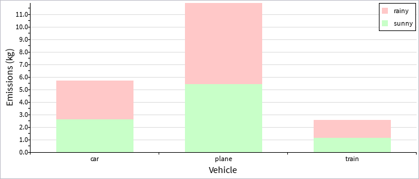

## Chart Package

This package has a set of components for drawing different kinds of chart to visualise data.

We start by showing how to draw a simple chart using this library, and expand on this example with all of the other chart types available.

Create a new file `App.dn` and open it in a text editor. We're going to use the same dependencies as a simple GUI application, plus a CSV parser and a chart (we'll start with a bar chart). We're also going to use a PNG image encoder to save the chart to a PNG file. We start with this code in our new source file:

```
component provides App requires ui.IOLayer coreui, ui.Window, stats.chart.Category:bar, data.csv.CSVParser parser,
							 io.File, data.StringUtil stringUtil, data.DecUtil du, media.image.ImageEncoder:png {
    }
```

The `App` interface has one function called `main`. Any executable component will implement App, indicating it has a main method that Dana can launch.

We're going to assume that we have some input data in a CSV file which looks like this:

```
car, "2.0, 3.0, 1.5, 2.6, 3.9"
plane, "5.0, 9.2, 1.01, 6.2, 5.8"
train, "1.2, 1.4, 0.15, 1.8, 1.1"
```

Each row in our input data has two columns: a category, and a set of values for that category.

We now need to implement our App interface, which we'll do like this:

```
const int WINDOW_WIDTH = 700
const int WINDOW_HEIGHT = 300

data Row {
	char category[]
	char values[]
	}

component provides App requires ui.IOLayer coreui, ui.Window, stats.chart.Category:bar, data.csv.CSVParser parser,
							 io.File, data.StringUtil stringUtil, data.DecUtil du, media.image.ImageEncoder:png {

	Window window
	char filename[]
	char outputPath[] = "chart.png"
	
	eventsink SystemEvents(EventData ed)
		{
		if (ed.source === coreui && ed.type == IOLayer.[ready])
		   {
		   startApp()
		   }
		}
	
	eventsink AppEvents(EventData ed)
		{
		if (ed.source === window && ed.type == Window.[close])
		   {
		   window.close()
		   coreui.shutdown()
		   }
		}

	void startApp()
		{
		//create the window and add the chart
		window = new Window("Chart")
		window.setSize(WINDOW_WIDTH, WINDOW_HEIGHT)
		window.setVisible(true)
		
		sinkevent AppEvents(window)
		
		//prep the graph data
		ChartCore chart = createGraph(filename)
		
		window.addObject(chart)
		
		//save to PNG
		File fd = new File(outputPath, File.CREATE)
		ImageEncoder encoder = new ImageEncoder:png()
		encoder.setPixels(window.getPixels())
		encoder.saveImage(fd)
		fd.close()
		}
	
	ChartCore createGraph(char path[])
		{
		File fd = new File(path, File.READ)
		Row rows[] = parser.parseDocument(fd, false, ",", new Row())
		fd.close()
		
		Category chart = new Category:bar()
		
		chart.setSize(WINDOW_WIDTH, WINDOW_HEIGHT)
		
		chart.setYMarkerInterval(0.5)
		chart.setYGridInterval(1.0)
		chart.setYLabelInterval(1.0)
		chart.setAxisLabels("Vehicle", "Emissions (kg)")
		chart.showErrorBars(true)
		
		for (int i = 0; i < rows.arrayLength; i++)
			{
			String parts[] = rows[i].values.explode(", ")
			dec values[] = new dec[parts.arrayLength]
			for (int j = 0; j < values.arrayLength; j++)
				values[j] = du.decFromString(parts[j].string)
			
			chart.addSample(rows[i].category, values)
			}
		
		return chart
		}

	int App:main(AppParam params[])
		{
		filename = params[0].string
		
		//initialise the system-level UI framework
		coreui.init()
		
		//listen for startup events from the system
		sinkevent SystemEvents(coreui)
		
		//run UI system loop, which blocks until last window closed
		coreui.run()
		
		return 0
		}

	}
```

Most of this code is the same a basic GUI example: we prepare the GUI subsystem, wait for a ready event, then create our window. We then call a `createGraph()` function to instantiate and feed data into our graph, and to configure the way in which the axes and labels will appear.

We can now compile the program using the Dana compiler. Open a command-prompt in the directory containing your source code file and type:

`dnc App.dn`

And pressing enter. This will compile your component.

We run the program using Dana's interpreter by typing:

`dana App mydata.csv`

And pressing enter. Assuming you have a CSV file in the same directory, with the content as described above, you should see your simple bar graph drawn on the screen.

In this example we used the APIs:

- [ui.IOLayer](../../../files/ui.IOLayer_IOLayer.html)
- [ui.Window](../../../files/ui.Window_Window.html)
- [stats.chart.Category](../../../files/stats.chart.Category_Category.html)

## List of chart types

Here we describe every chart type available in this package. We assume that every chart type uses the above basic application code to create the graph. In each example we change up to three things: the `createGraph()` function to create the appropriate chart; the `requires` interface `stats.chart.Category:bar` to be the relevant chart type; and the data type `Row` to match the CSV data input.

### Category data

#### Single-series bar chart

 

`requires stats.chart.Category:bar` or `requires stats.chart.Category:barH`

Here we assume an identical CSV file to the starting example. We change only the requires interface as above, and for the horizontal bar graph (`barH`) we change the `createGraph()` implementation to:

```
ChartCore createGraph(char path[])
	{
	File fd = new File(path, File.READ)
	Row rows[] = parser.parseDocument(fd, false, ",", new Row())
	fd.close()
	
	Category chart = new Category:barH()
	
	chart.setSize(WINDOW_WIDTH, WINDOW_HEIGHT)
	
	chart.setXMarkerInterval(0.5)
	chart.setXGridInterval(1.0)
	chart.setXLabelInterval(1.0)
	chart.setAxisLabels("Emissions (kg)", "Vehicle")
	chart.showErrorBars(true)
	
	for (int i = 0; i < rows.arrayLength; i++)
		{
		String parts[] = rows[i].values.explode(", ")
		dec values[] = new dec[parts.arrayLength]
		for (int j = 0; j < values.arrayLength; j++)
			values[j] = du.decFromString(parts[j].string)
		
		chart.addSample(rows[i].fruit, values)
		}
	
	return chart
	}
```

#### Single-series box plot

 

`requires stats.chart.Category:box` or `requires stats.chart.Category:boxH`

A box plot displays more detailed information about the distribution of data, with a median and interquartile range. We again use the same CSV file, but change our required interface as noted above to `:box` or `:boxH`, and change our `createGraph()` function to:

```
ChartCore createGraph(char path[])
	{
	File fd = new File(path, File.READ)
	Row rows[] = parser.parseDocument(fd, false, ",", new Row())
	fd.close()
	
	Category chart = new Category:box()
	
	chart.setSize(WINDOW_WIDTH, WINDOW_HEIGHT)
	
	chart.setYMarkerInterval(0.5)
	chart.setYGridInterval(1.0)
	chart.setYLabelInterval(1.0)
	chart.setAxisLabels("Vehicle", "Emissions (kg)")
	chart.showErrorBars(true)
	
	for (int i = 0; i < rows.arrayLength; i++)
		{
		String parts[] = rows[i].values.explode(", ")
		dec values[] = new dec[parts.arrayLength]
		for (int j = 0; j < values.arrayLength; j++)
			values[j] = du.decFromString(parts[j].string)
		
		chart.addSample(rows[i].fruit, values)
		}
	
	return chart
	}
```

#### Multi-series bar chart

 

`requires stats.chart.CategoryMulti:bar` or `requires stats.chart.CategoryMulti:barH`

Here our CSV input data has a category, series, and values field:

```
car, sunny, "2.0, 3.0, 1.5, 2.6, 3.9"
plane, sunny, "5.0, 9.2, 1.01, 6.2, 5.8"
train, sunny, "1.2, 1.4, 0.15, 1.8, 1.1"
car, rainy, "2.5, 3.5, 2.0, 3.1, 4.4"
plane, rainy, "6.0, 10.2, 2.01, 7.2, 6.8"
train, rainy, "1.5, 1.7, 0.45, 2.1, 1.4"
```

Our definition of the Row data type has changed to match this new input format:

```
data Row {
	char category[]
	char condition[]
	char values[]
	}
```

And our `createGraph()` function looks like this:

```
ChartCore createGraph(char path[])
	{
	File fd = new File(path, File.READ)
	Row rows[] = parser.parseDocument(fd, false, ",", new Row())
	fd.close()
	
	CategoryMulti chart = new CategoryMulti:bar()
	
	chart.setSize(WINDOW_WIDTH, WINDOW_HEIGHT)
	
	chart.addSeries("sunny")
	chart.setSeriesColor("sunny", new Color(200, 255, 200, 255))
	chart.addSeries("rainy")
	chart.setSeriesColor("rainy", new Color(255, 200, 200, 255))
	
	chart.setYMarkerInterval(0.5)
	chart.setYGridInterval(1.0)
	chart.setYLabelInterval(1.0)
	chart.setAxisLabels("Vehicle", "Emissions (kg)")
	chart.showErrorBars(true)
	chart.showLegend(true)
	
	for (int i = 0; i < rows.arrayLength; i++)
		{
		String parts[] = rows[i].values.explode(", ")
		dec values[] = new dec[parts.arrayLength]
		for (int j = 0; j < values.arrayLength; j++)
			values[j] = du.decFromString(parts[j].string)
		
		chart.addSample(rows[i].condition, rows[i].category, values)
		}
	
	return chart
	}
```

Note the order of parameters here to `addSample()`: the series comes first, then the category, then the values. Also note that we **must** configure the list of series via `addSeries()` before adding any data points for a given series.

#### Multi-series stacked bars

 

`requires stats.chart.CategoryMulti:stackedBar` or `requires stats.chart.CategoryMulti:stackedBarH`

Here we assume the same data input format as the above multi-series bar charts, with only our `createGraph()` function changing to use:

```
CategoryMulti chart = new CategoryMulti:stackedBar()
```

#### Multi-series box plots

 

`requires stats.chart.CategoryMulti:box` or `requires stats.chart.CategoryMulti:boxH`

Here we again assume the same data input format as the above multi-series bar charts, with only our `createGraph()` function changing to use:

```
CategoryMulti chart = new CategoryMulti:box()
```

#### Barcode chart

 

`requires stats.chart.CategoryMulti:barcode` or `requires stats.chart.CategoryMulti:barcodeH`

This chart type is useful for showing the distribution of different kinds of discrete events (for example over time). This chart behaves differently to the stacked bar chart in that each data point is added to a bar in-order (rather than grouping together all points for a particular series).

Here we assume that our CSV data input file looks like this:

```
monday, rain, 2.0
monday, sun, 2.0
monday, cloud, 2.0
monday, cloud, 2.0
monday, sun, 2.0
monday, sun, 2.0
monday, sun, 2.0
monday, cloud, 2.0
tuesday, sun, 2.0
tuesday, sun, 2.0
tuesday, sun, 2.0
tuesday, sun, 2.0
tuesday, sun, 2.0
tuesday, sun, 2.0
tuesday, sun, 2.0
tuesday, cloud, 2.0
wednesday, cloud, 2.0
wednesday, cloud, 2.0
wednesday, sun, 2.0
wednesday, sun, 2.0
wednesday, cloud, 2.0
wednesday, sun, 2.0
wednesday, sun, 2.0
wednesday, cloud, 2.0
```

Our Row data type is defined as:

```
data Row {
	char category[]
	char condition[]
	dec value
	}
```

And our `createGraph()` function is:

```
ChartCore createGraph(char path[])
	{
	File fd = new File(path, File.READ)
	Row rows[] = parser.parseDocument(fd, false, ",", new Row())
	fd.close()
	
	CategoryMulti chart = new CategoryMulti:barcode()
	
	chart.setSize(WINDOW_WIDTH, WINDOW_HEIGHT)
	
	chart.addSeries("sun")
	chart.setSeriesColor("sun", new Color(240, 200, 100, 255))
	chart.addSeries("rain")
	chart.setSeriesColor("rain", new Color(100, 100, 255, 255))
	chart.addSeries("cloud")
	chart.setSeriesColor("cloud", new Color(130, 130, 130, 255))
	
	chart.setYMarkerInterval(0.5)
	chart.setYGridInterval(1.0)
	chart.setYLabelInterval(1.0)
	chart.setAxisLabels("Day", "Time")
	chart.showErrorBars(true)
	chart.showLegend(true)
	
	for (int i = 0; i < rows.arrayLength; i++)
		{
		chart.addSample(rows[i].condition, rows[i].category, rows[i].value)
		}
	
	return chart
	}
```


### Time series data

#### Single-series line graph


`requires stats.chart.Series:line`

Here we assume that our CSV input as a time-series, with one column for the time, and the other for the value(s) at that time:

```
0.0, "0.0"
1.0, "3.0, 3.5, 4.7"
2.0, "4.0, 4.5, 5.7"
3.0, "5.0, 5.5, 6.7"
3.5, "6.2, 6.8, 6.6"
4.0, "6.4, 6.5, 6.6"
```

We define our Row data type to match this, as:

```
data Row {
	dec time
	char values[]
	}
```

And our `createGraph()` function is:

```
ChartCore createGraph(char path[])
	{
	File fd = new File(path, File.READ)
	Row rows[] = parser.parseDocument(fd, false, ",", new Row())
	fd.close()
	
	Series chart = new Series:line()
	
	chart.setSize(WINDOW_WIDTH, WINDOW_HEIGHT)
	
	chart.setYMarkerInterval(0.5)
	chart.setYGridInterval(1.0)
	chart.setYLabelInterval(1.0)
	chart.setXMarkerInterval(0.5)
	chart.setXLabelInterval(1.0)
	chart.setAxisLabels("Time (s)", "Speed (m/s)")
	chart.showErrorBars(true)
	
	for (int i = 0; i < rows.arrayLength; i++)
		{
		String parts[] = rows[i].values.explode(", ")
		dec values[] = new dec[parts.arrayLength]
		for (int j = 0; j < values.arrayLength; j++)
			values[j] = du.decFromString(parts[j].string)
		
		chart.addSample(rows[i].time, values)
		}
	
	return chart
	}
```

#### Multi-series line graph


`requires stats.chart.SeriesMulti:line`

Here we assume a CSV data input file with both time and series data, plus values for each time point:

```
"Lion", 0.0, "0.0"
"Lion", 1.0, "3.0, 3.5, 4.7"
"Lion", 2.0, "4.0, 4.5, 5.7"
"Lion", 3.0, "5.0, 5.5, 6.7"
"Lion", 3.5, "6.2, 6.8, 6.6"
"Lion", 4.0, "6.4, 6.5, 6.6"
"Tiger", 0.0, "0.0"
"Tiger", 1.0, "4.0, 4.5, 5.7"
"Tiger", 2.0, "5.0, 5.5, 6.7"
"Tiger", 3.0, "6.0, 6.5, 7.7"
"Tiger", 3.5, "7.2, 7.8, 7.6"
"Tiger", 4.0, "7.4, 7.5, 7.6"
"Gazelle", 0.0, "0.0"
"Gazelle", 1.0, "5.0, 5.5, 6.7"
"Gazelle", 2.0, "6.0, 6.5, 7.7"
"Gazelle", 3.0, "7.0, 7.5, 8.7"
"Gazelle", 3.5, "8.2, 8.8, 8.6"
"Gazelle", 4.0, "8.4, 8.5, 8.6"
"Zebra", 0.0, "0.0"
"Zebra", 1.0, "4.0, 5.5, 3.7"
"Zebra", 2.0, "5.0, 5.5, 7.7"
"Zebra", 3.0, "5.0, 5.5, 6.7"
"Zebra", 3.5, "4.2, 4.8, 4.6"
"Zebra", 4.0, "2.4, 2.5, 2.6"
```

Our `Row` data type is defined to match this format, as:

```
data Row {
	char series[]
	dec time
	char values[]
	}
```

And our `createGraph()` function is:

```
ChartCore createGraph(char path[])
	{
	File fd = new File(path, File.READ)
	Row rows[] = parser.parseDocument(fd, false, ",", new Row())
	fd.close()
	
	SeriesMulti chart = new SeriesMulti:line()
	
	chart.setSize(WINDOW_WIDTH, WINDOW_HEIGHT)
	
	chart.addSeries("Lion")
	chart.setSeriesColor("Lion", new Color(155, 130, 50, 255))
	chart.setSeriesMarkers("Lion", SeriesMulti.M_SQUARE)
	chart.addSeries("Tiger")
	chart.setSeriesColor("Tiger", new Color(120, 120, 230, 255))
	chart.setSeriesMarkers("Tiger", SeriesMulti.M_SQUARE_OUTLINE)
	chart.addSeries("Gazelle")
	chart.setSeriesColor("Gazelle", new Color(220, 100, 100, 255))
	chart.setSeriesMarkers("Gazelle", SeriesMulti.M_CROSS)
	chart.addSeries("Zebra")
	chart.setSeriesColor("Zebra", new Color(20, 10, 10, 255))
	
	chart.setYMarkerInterval(0.5)
	chart.setYGridInterval(1.0)
	chart.setYLabelInterval(1.0)
	chart.setXMarkerInterval(0.5)
	chart.setXLabelInterval(1.0)
	chart.setAxisLabels("Time (s)", "Speed (m/s)")
	//chart.showLegend(true)
	chart.showErrorBars(true)
	
	for (int i = 0; i < rows.arrayLength; i++)
		{
		String parts[] = rows[i].values.explode(", ")
		dec values[] = new dec[parts.arrayLength]
		for (int j = 0; j < values.arrayLength; j++)
			values[j] = du.decFromString(parts[j].string)
		
		chart.addSample(rows[i].series, rows[i].time, values)
		}
	
	return chart
	}
```

### Correlation data

#### Scatter plot


`requires stats.chart.SeriesMulti:scatter`

Correlation data works essentially in the same way as line-graph data; we assume the same CSV input format as in our multi-series line graph above, with our `createGraph()` function defined as:

```
ChartCore createGraph(char path[])
	{
	File fd = new File(path, File.READ)
	Row rows[] = parser.parseDocument(fd, false, ",", new Row())
	fd.close()
	
	SeriesMulti chart = new SeriesMulti:scatter()
	
	chart.setSize(WINDOW_WIDTH, WINDOW_HEIGHT)
	
	chart.addSeries("Lion")
	chart.setSeriesColor("Lion", new Color(155, 130, 50, 255))
	chart.setSeriesMarkers("Lion", SeriesMulti.M_SQUARE)
	chart.addSeries("Tiger")
	chart.setSeriesColor("Tiger", new Color(120, 120, 230, 255))
	chart.setSeriesMarkers("Tiger", SeriesMulti.M_SQUARE_OUTLINE)
	chart.addSeries("Gazelle")
	chart.setSeriesColor("Gazelle", new Color(220, 100, 100, 255))
	chart.setSeriesMarkers("Gazelle", SeriesMulti.M_CROSS)
	chart.addSeries("Zebra")
	chart.setSeriesColor("Zebra", new Color(20, 10, 10, 255))
	chart.setSeriesMarkers("Zebra", SeriesMulti.M_PLUS)
	
	chart.setYMarkerInterval(0.5)
	chart.setYGridInterval(1.0)
	chart.setYLabelInterval(1.0)
	chart.setXMarkerInterval(0.5)
	chart.setXLabelInterval(1.0)
	chart.setAxisLabels("Time (s)", "Speed (m/s)")
	
	for (int i = 0; i < rows.arrayLength; i++)
		{
		String parts[] = rows[i].values.explode(", ")
		dec values[] = new dec[parts.arrayLength]
		for (int j = 0; j < values.arrayLength; j++)
			values[j] = du.decFromString(parts[j].string)
		
		chart.addSample(rows[i].series, rows[i].time, values)
		}
	
	return chart
	}
```
