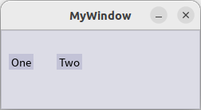
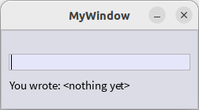
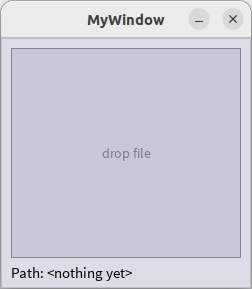
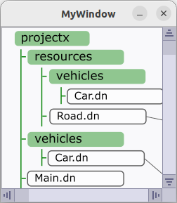
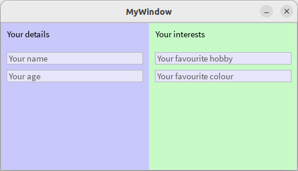
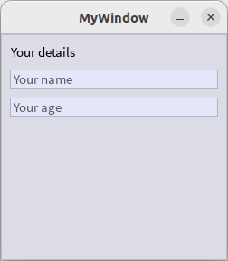
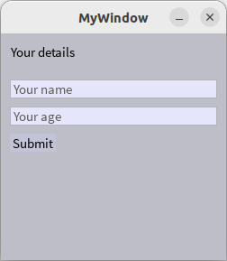
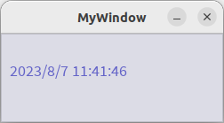
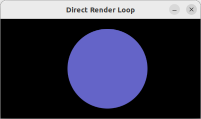

## UI Framework

The UI package contains a rich set of user interface controls to create desktop applications, and is easily extensible to create custom UI widgets.

### General GUI application structure

This program shows how we can write a simple graphical user interface application.



Create a new file `Main.dn` and open it in a text editor. We're going to use the `IOLayer` interface for the GUI toolkit, the `Window` interface, the `Button` interface, and the command-line output interface. We'll start with this code in our new file:

```
component provides App requires ui.IOLayer coreui, ui.Window,
				ui.Button, io.Output out {

Window window
Button b1
Button b2

eventsink AppEvents(EventData ed)
	{
	if (ed.type == Button.[click] && ed.source === b1)
		{
		out.println("A BUTTON CLICK!")
		}
		else if (ed.type == Button.[click] && ed.source === b2)
		{
		out.println("A BUTTON CLICK TOO!")
		}
	}

eventsink SysEvents(EventData ed)
	{
	if (ed.source === coreui && ed.type == IOLayer.[ready])
		{
		startApp()
		}
		else if (ed.source === window && ed.type == Window.[close])
		{
		window.close()
		coreui.shutdown()
		}
	}

void startApp()
	{
	window = new Window("MyWindow")
	window.setSize(250, 100)
	window.setVisible(true)
	
	b1 = new Button("One")
	b2 = new Button("Two")
	
	b1.setPosition(10, 30)
	b2.setPosition(70, 30)
	
	window.addObject(b1)
	window.addObject(b2)
	
	sinkevent AppEvents(b1)
	sinkevent AppEvents(b2)
	
	sinkevent SysEvents(window)
	}

int App:main(AppParam params[])
	{
	//initialise the system-level UI framework
	coreui.init()
	
	//listen for startup events from the system
	sinkevent SysEvents(coreui)
	
	//run UI system loop, which blocks until last window closed
	coreui.run()
	
	return 0
	}

}
```

There's quite a lot going on here, so we'll walk through each part. The main() method starts up the `IOLayer` framework, which prepares the GUI subsystem to do some work. It then listens for events from the `IOLayer` framework itself, which will tell us when the framework is ready to go. We then run the main `IOLayer` system loop in `coreui.run()`, which dispatches an OS-level event loop.

To receive events from both the `IOLayer` framework, and from our own window, we choose to declare two different event sinks, `SysEvents` and `AppEvents`. While we could have used the same event sink for all events in this example, we've chosen to separate out those events pertaining to the `IOLayer` framework and the event which indicates a user has clicked the close button on the window; directing these events to their own event synch ensures that these events are always responsive in cases where the AppEvents event sink orchestrates longer-lived periods of compute. Our event sink methods will be triggered whenever we receive an event from an object which we have connected to that sink. Event sinks use a queue of events that they have received, and so only a single `AppEvents` thread is ever running at a time. Within our event sinks we check the source of the event using a reference check, then check the type of the event.

When we first receive the `ready` event from the `IOLayer` framework, we call a function which sets up our application window, and adds two buttons to the window. Each button object can emit events, and we connect those objects to our `AppEvents` sink. Whenever a button is clicked on, we then get a click event to our `AppEvents` sink, and we print out some text to the command line.

We can now compile the program using the Dana compiler. Open a command-prompt in the directory containing your source code file and type:

`dnc Main.dn`

And pressing enter. This will compile your component.

We run the program using Dana's interpreter by typing:

`dana Main`

And pressing enter. You should see a window with two buttons that you can click on.

### Using TextField and Label controls

This example shows the use of a text input field, and a text label. When the user makes changes to the text in the text input field, each change occurrence is notified to the application, which then sets the content of the label to reflect that of the text field.



```
component provides App requires ui.IOLayer coreui, ui.Window,
				ui.TextField, ui.Label, io.Output out {

Window window
TextField field
Label label

eventsink AppEvents(EventData ed)
	{
	if (ed.source === field && ed.type == TextField.[textChanged])
		{
		label.setText("You wrote: $(field.getText())")
		}
	}

eventsink SysEvents(EventData ed)
	{
	if (ed.source === coreui && ed.type == IOLayer.[ready])
		{
		startApp()
		}
		else if (ed.source === window && ed.type == Window.[close])
		{
		window.close()
		coreui.shutdown()
		}
	}

void startApp()
	{
	window = new Window("MyWindow")
	window.setSize(250, 100)
	window.setVisible(true)
	
	field = new TextField()
	label = new Label("You wrote: <nothing yet>")
	
	field.setWidth(230)
	
	field.setPosition(10, 30)
	label.setPosition(10, 60)
	
	window.addObject(field)
	window.addObject(label)
	
	sinkevent AppEvents(field)
	sinkevent AppEvents(label)
	
	field.setFocus()
	
	sinkevent SysEvents(window)
	}

int App:main(AppParam params[])
	{
	//initialise the system-level UI framework
	coreui.init()
	
	//listen for startup events from the system
	sinkevent SysEvents(coreui)
	
	//run UI system loop, which blocks until last window closed
	coreui.run()
	
	return 0
	}

}
```

If you assume your source code is saved in a file called `Main.dn`, open a command-prompt in the directory containing this file and type:

`dnc Main.dn`

`dana Main`

### Using FileDrop controls

This example shows the use of a file drop control, allowing files to be dragged and dropped over the control. When a user drops a file over the control, the drop event is notified to the application, which then sets the content of the label to reflect the file path of the entity, and also prints that path to the console.



```
component provides App requires ui.IOLayer coreui, ui.Window,
				ui.FileDrop, ui.Label, io.Output out {

Window window
FileDrop fileDrop
Label label

eventsink AppEvents(EventData ed)
	{
	if (ed.source === fileDrop && ed.type == FileDrop.[fileDrop])
		{
		String path = ed.details
		label.setText("Path: $(path.string)")
		out.println("Path: $(path.string)")
		}
	}

eventsink SysEvents(EventData ed)
	{
	if (ed.source === coreui && ed.type == IOLayer.[ready])
		{
		startApp()
		}
		else if (ed.source === window && ed.type == Window.[close])
		{
		window.close()
		coreui.shutdown()
		}
	}

void startApp()
	{
	window = new Window("MyWindow")
	window.setSize(250, 250)
	window.setVisible(true)
	
	fileDrop = new FileDrop()
	label = new Label("Path: <nothing yet>")
	
	fileDrop.setSize(230, 210)
	
	fileDrop.setPosition(10, 10)
	label.setPosition(10, 225)
	
	window.addObject(fileDrop)
	window.addObject(label)
	
	sinkevent AppEvents(fileDrop)
	sinkevent AppEvents(label)
	
	sinkevent SysEvents(window)
	}

int App:main(AppParam params[])
	{
	//initialise the system-level UI framework
	coreui.init()
	
	//listen for startup events from the system
	sinkevent SysEvents(coreui)
	
	//run UI system loop, which blocks until last window closed
	coreui.run()
	
	return 0
	}

}
```

If you assume your source code is saved in a file called `Main.dn`, open a command-prompt in the directory containing this file and type:

`dnc Main.dn`

`dana Main`

### Using ScrollPane and Image controls

This example shows the use of a scroll pane, allowing large GUI elements to be scrolled. When we place another GUI element as the content of a ScrollPane, that scroll pane checks how large that element is and generates appropriate scroll bar ranges to allow scrolling around the content. In this example we use an image as the content, which we load from a PNG file.



```
component provides App requires ui.IOLayer coreui, ui.Window,
				ui.Image, ui.ScrollPane, media.image.ImageEncoder:png, io.File, io.Output out {

Window window
Image image
ScrollPane scroll

eventsink AppEvents(EventData ed)
	{
	}

eventsink SysEvents(EventData ed)
	{
	if (ed.source === coreui && ed.type == IOLayer.[ready])
		{
		startApp()
		}
		else if (ed.source === window && ed.type == Window.[close])
		{
		window.close()
		coreui.shutdown()
		}
	}

void startApp()
	{
	window = new Window("MyWindow")
	window.setSize(250, 250)
	window.setVisible(true)
	
	File fd = new File("MyImage.png", File.READ)
	ImageEncoder encoder = new ImageEncoder:png()
	encoder.loadImage(fd)
	fd.close()
	
	image = new Image(encoder.getPixels())
	
	scroll = new ScrollPane()
	scroll.setSize(250, 250)
	scroll.setPosition(0, 0)
	
	scroll.setContent(image)
	
	window.addObject(scroll)
	
	sinkevent SysEvents(window)
	}

int App:main(AppParam params[])
	{
	//initialise the system-level UI framework
	coreui.init()
	
	//listen for startup events from the system
	sinkevent SysEvents(coreui)
	
	//run UI system loop, which blocks until last window closed
	coreui.run()
	
	return 0
	}

}
```

If you assume your source code is saved in a file called `Main.dn`, and this directory also has a PNG image file called `MyImage.png`, we open a command-prompt in the directory containing this file and type:

`dnc Main.dn`

`dana Main`

### Using Panels

Many GUI designs group elements into distinct regions of the interface. The Panel API supports such groupings, and can be a helpful way to organise the different areas of a GUI.



In the below example we've set the panels to have very different background colours to help show where they are on the window, and within the `startApp()` function we add each GUI element to its appropriate panel and then add the panels to the window. Notice that the positioning of GUI elements within a panel is relative to the panel's content area, not the window.


```
component provides App requires ui.IOLayer coreui, ui.Window,
				ui.Panel, ui.TextField, ui.Label, io.Output out {

Window window
Panel leftPanel
Panel rightPanel
Label leftTitle
Label rightTitle
TextField nameField
TextField ageField
TextField hobbyField
TextField colourField

eventsink AppEvents(EventData ed)
	{
	}

eventsink SysEvents(EventData ed)
	{
	if (ed.source === coreui && ed.type == IOLayer.[ready])
		{
		startApp()
		}
		else if (ed.source === window && ed.type == Window.[close])
		{
		window.close()
		coreui.shutdown()
		}
	}

void startApp()
	{
	window = new Window("MyWindow")
	window.setSize(500, 250)
	window.setVisible(true)
	
	leftPanel = new Panel()
	leftPanel.setSize(250, 250)
	
	rightPanel = new Panel()
	rightPanel.setSize(250, 250)
	
	leftPanel.setPosition(0, 0)
	rightPanel.setPosition(250, 0)
	
	leftPanel.setBackground(new Color(200, 200, 250, 255))
	rightPanel.setBackground(new Color(200, 250, 200, 255))
	
	leftTitle = new Label("Your details")
	leftTitle.setPosition(10, 10)
	leftPanel.addObject(leftTitle)
	
	nameField = new TextField()
	nameField.setWidth(230)
	nameField.setPosition(10, 50)
	nameField.setPlaceholder("Your name")
	leftPanel.addObject(nameField)
	
	ageField = new TextField()
	ageField.setWidth(230)
	ageField.setPosition(10, 80)
	ageField.setPlaceholder("Your age")
	leftPanel.addObject(ageField)
	
	rightTitle = new Label("Your interests")
	rightTitle.setPosition(10, 10)
	rightPanel.addObject(rightTitle)
	
	hobbyField = new TextField()
	hobbyField.setWidth(230)
	hobbyField.setPosition(10, 50)
	hobbyField.setPlaceholder("Your favourite hobby")
	rightPanel.addObject(hobbyField)
	
	colourField = new TextField()
	colourField.setWidth(230)
	colourField.setPosition(10, 80)
	colourField.setPlaceholder("Your favourite colour")
	rightPanel.addObject(colourField)
	
	window.addObject(leftPanel)
	window.addObject(rightPanel)
	
	sinkevent SysEvents(window)
	}

int App:main(AppParam params[])
	{
	//initialise the system-level UI framework
	coreui.init()
	
	//listen for startup events from the system
	sinkevent SysEvents(coreui)
	
	//run UI system loop, which blocks until last window closed
	coreui.run()
	
	return 0
	}

}
```

If you assume your source code is saved in a file called `Main.dn`, open a command-prompt in the directory containing this file and type:

`dnc Main.dn`

`dana Main`

### Using a Layout manager

Most of the examples on this page use absolute positioning for each GUI element. This approach can be verbose when arranging a large number of GUI elements. A more declarative approach to layout management often results in more concise code -- and can also more easily support adjustments to window size changes.

In the below example we use a layout manager to position GUI elements relative to each other. We first position a title label 10 pixels below the top of the window, and 10 pixels in from the left edge.

We then position a text field below the title with a 10-pixel gap, and align their left edges. We then position a further text field below that one, again with their left edges aligned.



```
component provides App requires ui.IOLayer coreui, ui.Window,
				ui.TextField, ui.Label, ui.Layout, io.Output out {

Window window
Layout layout
Label title
TextField nameField
TextField ageField

eventsink AppEvents(EventData ed)
	{
	}

eventsink SysEvents(EventData ed)
	{
	if (ed.source === coreui && ed.type == IOLayer.[ready])
		{
		startApp()
		}
		else if (ed.source === window && ed.type == Window.[close])
		{
		window.close()
		coreui.shutdown()
		}
	}

void startApp()
	{
	window = new Window("MyWindow")
	window.setSize(250, 250)
	window.setVisible(true)
	
	layout = new Layout()
	layout.setSize(250, 250)
	
	title = new Label("Your details")
	layout.add(title, new LayoutRule[](new LayoutRule(LayoutRule.BELOW, 10), new LayoutRule(LayoutRule.RIGHT, 10)))
	window.addObject(title)
	
	nameField = new TextField()
	nameField.setWidth(230)
	nameField.setPlaceholder("Your name")
	layout.add(nameField, new LayoutRule(new byte[](LayoutRule.BELOW, LayoutRule.ALIGN_LEFT), 10, title))
	window.addObject(nameField)
	
	ageField = new TextField()
	ageField.setWidth(230)
	ageField.setPlaceholder("Your age")
	layout.add(ageField, new LayoutRule(new byte[](LayoutRule.BELOW, LayoutRule.ALIGN_LEFT), 10, nameField))
	window.addObject(ageField)
	
	sinkevent SysEvents(window)
	}

int App:main(AppParam params[])
	{
	//initialise the system-level UI framework
	coreui.init()
	
	//listen for startup events from the system
	sinkevent SysEvents(coreui)
	
	//run UI system loop, which blocks until last window closed
	coreui.run()
	
	return 0
	}

}
```

If you assume your source code is saved in a file called `Main.dn`, open a command-prompt in the directory containing this file and type:

`dnc Main.dn`

`dana Main`

### Composite UI controls

Sometimes it's useful to group a number of existing UI widgets together into a composite control which has its own specialised functions and events. Here we use an example of a custom, application-specific composite control for some user details.



We first declare a new interface type, `DetailsInput`, and place it into the file `resources/ui/DetailsInput.dn`:

```
interface DetailsInput extends ui.Panel {
	
	event go()
	
	DetailsInput()
	
	char[] getName()
	}
```

This interface extends `Panel` and provides a single event and a function to get the user's name.

We implement this interface in a source file `ui/DetailsInput.dn` as follows:

```
component provides DetailsInput requires ui.TextField, ui.Label, ui.Button, ui.Panel {

	Label title
	TextField nameField
	TextField ageField
	Button button

	eventsink AppEvents(EventData ed)
		{
		if (ed.source === button && ed.type == Button.[click])
			{
			emitevent go()
			}
		}

	DetailsInput:DetailsInput()
		{
		super()
		
		title = new Label("Your details")
		title.setPosition(10, 10)
		addObject(title)
		
		nameField = new TextField()
		nameField.setWidth(230)
		nameField.setPosition(10, 50)
		nameField.setPlaceholder("Your name")
		addObject(nameField)
		
		ageField = new TextField()
		ageField.setWidth(230)
		ageField.setPosition(10, 80)
		ageField.setPlaceholder("Your age")
		addObject(ageField)
		
		button = new Button("Submit")
		button.setPosition(10, 110)
		sinkevent AppEvents(button)
		addObject(button)
		}

	char[] DetailsInput:getName()
		{
		return nameField.getText()
		}

	void DetailsInput:setDisabled(bool v) { super(v) }
	void DetailsInput:clickMulti(int x, int y, int b, int clicks) { super(x, y, b, clicks) }
	void DetailsInput:contextClick(MenuItem item) { super(item) }
	bool DetailsInput:recvFocus() { return super()	}
	HotKey[] DetailsInput:getHotKeys() { return super()	}
	void DetailsInput:loseFocus() { super() }
	void DetailsInput:hotKeyClick(HotKey k) { super(k) }
	void DetailsInput:mouseDown(int x, int y, int b) { super(x, y, b) }
	void DetailsInput:mouseUp(int x, int y, int b) { super(x, y, b) }
	void DetailsInput:mouseMove(int x, int y){ super(x, y) }
	void DetailsInput:dropFile(int x, int y, char path[]){ super(x, y, path) }
	CursorSetEvent DetailsInput:mouseOver(int x, int y){ return super(x, y) }
	void DetailsInput:mouseOut(){ super() }
	void DetailsInput:mouseWheel(int xAdd, int xSub, int yAdd, int ySub){ super(xAdd, xSub, yAdd, ySub) }

}
```

In our constructor we set up all of the internal GUI elements of our composite control, and also register for button click events to be sent to our internal event sink. Notice that we have also provided a set of implementations of `Panel` functions which we need to pass through as `super()` calls to the `Panel` instance that we've extended. The implementations of these functions would genernally always be the same for any composite control, so you can generally just copy this entire block of functions.

Finally we write the GUI application which uses this composite control, for example:

```
component provides App requires ui.IOLayer coreui, ui.Window,
				ui.DetailsInput, io.Output out {

Window window
DetailsInput input

eventsink AppEvents(EventData ed)
	{
	if (ed.source === input && ed.type == DetailsInput.[go])
		{
		out.println("Details were: $(input.getName())")
		}
	}

eventsink SysEvents(EventData ed)
	{
	if (ed.source === coreui && ed.type == IOLayer.[ready])
		{
		startApp()
		}
		else if (ed.source === window && ed.type == Window.[close])
		{
		window.close()
		coreui.shutdown()
		}
	}

void startApp()
	{
	window = new Window("MyWindow")
	window.setSize(250, 250)
	window.setVisible(true)
	
	input = new DetailsInput()
	input.setSize(250, 250)
	input.setPosition(0, 0)
	
	sinkevent AppEvents(input)
	window.addObject(input)
	
	sinkevent SysEvents(window)
	}

int App:main(AppParam params[])
	{
	//initialise the system-level UI framework
	coreui.init()
	
	//listen for startup events from the system
	sinkevent SysEvents(coreui)
	
	//run UI system loop, which blocks until last window closed
	coreui.run()
	
	return 0
	}

}
```

Our application code instantiates our composite control and adds it to the window, then listens for `go` events from that instance.

To compile and run this project, first compile the composite control by typing:

`dnc ui`

(this compiles everything in the `ui` package, which should include the composite control if you placed it in the correct file)

Then we compile and run our application code, assuming it's in a source file called `Main.dn`:

`dnc Main.dn`

`dana Main.o`

### Creating your own GUI widgets

You can create your own new GUI widgets by extending one of the following UI interfaces. Each of these interfaces provides additional notitications from the GUI framework, depending on whether you want your new widget to be non-interactable (GraphicsObject), to receive mouse-click notifications (ClickableObject), to receive fine-grained mouse events (XYMouseObject), or to also receive keyboard events (KeyEventObject):


Below we provide examples of designing new widgets that inherit from each of these levels of the GUI hierarchy.

#### GraphicsObject

This interface provides the following functions, all of which you must implement in your new UI widget:

```
void postRepaint()
void paint(Canvas c)
void setPosition(int x, int y)
Point getPosition()
WH getPreferredSize()
```

We'll use this interface to design a new UI widget which shows the current time. This widget just displays information and will not be interactable, so we don't need any notifications from the UI framework which are offered by the other sub-type interfaces.



We start by designing our new widget's own interface type, which we'll save into a file `resources/ui/Clock.dn` and define as follows:

```
interface Clock extends GraphicsObject {
	
	Clock()
	
	}
```

All we've done here is extend GraphicsObject, which will allow instances of our new interface to be added to a window, and declared a constructor.

We now implement this interface in a file `ui/Clock.dn` as follows:

```
component provides Clock(Destructor) requires time.Timer timer, time.Calendar cal, ui.Font, os.SystemInfo sysInfo, data.IntUtil iu {
	
	Font font
	Color color
	char text[]
	
	bool shutdown
	Thread thread
	
	void setTimeString()
		{
		DateTime dt = cal.getTime()
		text = "$(dt.year)/$(dt.month)/$(dt.day) $(dt.hour):$(dt.minute):$(dt.second)"
		}
	
	Clock:Clock()
		{
		font = new Font(sysInfo.getSystemFont(false), 18)
		color = new Color(100, 100, 200, 255)
		setTimeString()
		thread = asynch::timeThread()
		}
	
	void timeThread()
		{
		while (!shutdown)
			{
			timer.sleep(500)
			setTimeString()
			postRepaint()
			}
		}
	
	void Clock:paint(Canvas c)
		{
		c.text(new Point2D(xPosition, yPosition, color), font, text)
		}
		
	void Clock:postRepaint()
		{
		emitevent repaint()
		}
	
	void Clock:setPosition(int x, int y)
		{
		xPosition = x
		yPosition = y
		}
	
	Point Clock:getPosition()
		{
		return new Point(xPosition, yPosition)
		}
	
	WH Clock:getPreferredSize()
		{
		return new WH(100, 100)
		}
	
	void Destructor:destroy()
		{
		shutdown = true
		thread.join()
		}
	}
```

Here we implement our constructor, and must also implement each function from the `GraphicsObject` interface (there is no base implementation of these functions). The `paint()` function is perhaps the most interesting one here, which is called whenever the window's contents are being redrawn. This function is given a `ui.Canvas` object as a parameter, and can use this canvas to issue a wide range of primitive drawing commands.

We now need to write an application which uses our new clock widget. Create a new source file in your project's root directory called `Main.dn`, and in this source file write the following code:

```
component provides App requires ui.IOLayer coreui, ui.Window,
				ui.Clock, io.Output out {

Window window
Clock clock

eventsink AppEvents(EventData ed)
	{
	}

eventsink SysEvents(EventData ed)
	{
	if (ed.source === coreui && ed.type == IOLayer.[ready])
		{
		startApp()
		}
		else if (ed.source === window && ed.type == Window.[close])
		{
		window.close()
		coreui.shutdown()
		}
	}

void startApp()
	{
	window = new Window("MyWindow")
	window.setSize(250, 100)
	window.setVisible(true)
	
	clock = new Clock()
	
	clock.setPosition(10, 30)
	
	window.addObject(clock)
	
	sinkevent SysEvents(window)
	}

int App:main(AppParam params[])
	{
	//initialise the system-level UI framework
	coreui.init()
	
	//listen for startup events from the system
	sinkevent SysEvents(coreui)
	
	//run UI system loop, which blocks until last window closed
	coreui.run()
	
	return 0
	}

}
```

To compile and run this project, first compile our new GUI widget by typing:

`dnc ui`

(this compiles everything in the `ui` package, which should include the clock widget if you placed it in the correct file)

Then we compile and run our application code, assuming it's in a source file called `Main.dn`:

`dnc Main.dn`

`dana Main.o`

The set of sub-types of the `GraphicsObject` interface provide increasingly more detailed notifications from the GUI framework, including mouse clicks, mouse move input, or keyboard input. When designing a new GUI widget, choose which level of notifications your new widget needs from the GUI framework, create a new interface which extends the appropriate interface to receive those notitications, and implement the appropriate set of functions in your new widget.

The details of the sub-type interfaces is explained below.

#### ClickableObject

This interface provides the following additional events and functions which you may use or implement in your new UI widget:

**Events:**

```
click()
clickMulti(MultiClickData d)
contextMenuOn(ContextMenuSpec menu)
contextMenuOff()
requestFocus()
```

**Functions:**

```
void setDisabled(bool d)
Rect getBounds()
void click(int x, int y, int button)
void clickMulti(int x, int y, int button, int clicks)
void contextClick(MenuItem item)
void setFocus()
HotKey[] recvFocus()
void loseFocus()
void hotKeyClick(HotKey k)
```

This interface is typically extended by widgets which only want to receive "click"-style notifications, but which may also support a context menu (which pops up e.g. on a right-click).

#### XYMouseObject

This interface provides the following additional events and functions which you may use or implement in your new UI widget:

**Events:**

```
setCursor(CursorSetEvent cse)
```

**Functions:**

```
void mouseDown(int x, int y, int button)
void mouseUp(int x, int y, int button)
void mouseMove(int x, int y)
void dropFile(int x, int y, char path[])
void mouseOver()
void mouseOut()
void mouseWheel(int xAdd, int xSub, int yAdd, int ySub)
```

This interface is typically extended by widgets which need to track the specific mouse position and other detailed mouse input notifications.

#### KeyEventObject

This interface provides the following additional functions which you may implement in your new UI widget:

**Functions:**

```
void keyDown(int keyID)
void keyUp(int keyID)
```

This interface is typically extended by widgets which need to track keyboard input notifications.

### FlowRender game-like applications

As well as a framework designed for desktop applications, the UI package also includes a framework designed for videogame-like applications. These applications use a rendering loop, potentially running at a specific framerate, issue draw commands directly from that rendering loop, and collect input events from that loop.

Here we show a simple example of a rendering loop with an event processing function, running at a rate of 60 frames per second:



To create this example, make a new file `Main.dn` and open it in a text editor. We're going to use the `FlowRender` interface of UI package, and the `FlowCanvas` interface to do some simple 2D drawing using screen coordinates. Enter the following code:

```
component provides App requires ui.FlowRender, ui.FlowCanvas, ui.FlowFont, time.Timer timer, io.Output out {

	bool processEvents(FlowEvent events[])
		{
		bool quit = false
		for (int i = 0; i < events.arrayLength; i++)
			{
			if (events[i].type == FlowEvent.T_QUIT)
				{
				quit = true
				}
			}
		
		return quit
		}
	
	int App:main(AppParam params[])
		{
		FlowRender window = new FlowRender(60)
		window.setSize(400, 200)
		FlowCanvas canvas = new FlowCanvas(window)

		window.setTitle("Direct Render Loop")
		window.setVisible(true)

		Ellipse2D ball = new Ellipse2D(10, 100, 80, 80, new Color(100, 100, 200, 255))

		bool quit = false

		int x = 100
		bool right = true
		
		while (!quit)
			{
			FlowEvent events[] = window.getEvents()

			window.renderBegin()

			ball.x = x
			canvas.ellipse(ball)
			
			window.renderEnd()

			quit = processEvents(events)

			window.wait()

			if (right)
				{
				x += 2
				if (x > 300) right = false
				}
				else
				{
				x -= 2
				if (x == 80) right = true
				}
			}
		
		return 0
		}

}
```

The FlowCanvas API has the same set of API calls available as the Desktop app canvas drawing API, but allows the programmer direct control of these drawing commands rather than having them wrapped e.g. in GUI widgets.
